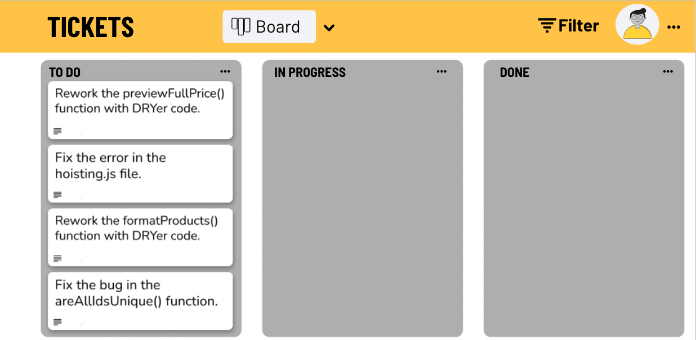

# JavaScript Functions WBP

You work for a company that publishes a small digital storefront that sells promotional goods for touring bands. The codebase is old, and many developers with different preferences for function syntax have worked on it over the past few years.

Your job is refactoring some parts of the code to reduce unnecessary repetition (DRY: Don't Repeat Yourself). There are also some .

---

1. Refactoring some parts of the code to reduce unnecessary repetition (DRY: Don't Repeat Yourself). 
2. Fix the known bugs in the code caused by incorrect use of function calls.

For this project, there won't be any need to open a browser. All of your code will be running on Node.js, and all your results will be visible in your terminal.

---

<!-- [Trello Board Tickets](https://trello.com/b/V2tKlN6Y/javascript-functions) -->

- In the `refactor.js` file, rework the `previewFullPrice()` function with DRYer code.
- Fix the error in the `hoisting.js` file.
- Fix the bug in the `areAllIdsUnique()` function in the `parameters.js` file.
- In the `firstClassFunctions.js` file, rework the `formatProducts()` function with DRYer code.

---

### Step 1:

- Fork and clone [this](https://git.generalassemb.ly/SEI-Standard-Curriculum/M1L5.1-functions-wbp) repository. Make sure you are logged in to your GitHub Enterprise account.
- Install Jest and any other dependencies using this command: `npm i`

### Step 2:

- Open your editor and navigate to `/Refactoring/refactor.js`

- This file contains a function that calculates the full price after tax and shipping for a few of the most commonly sold products. The code is very repetitive, as the previous developer would always copy and paste a block of code every time a new product was added.

- To complete this exercise, find the behavior that is being repeated for each product, and extract it into a function. Then, call that function once for each product and return the result.

- The code already returns the expected result and passes the automated test, so you will know your refactor is successful if it shortens the code, and the tests still pass after your changes.

- You can run the tests for just this exercise using this command:
  - `jest ./Refactoring/refactor.test.js`

### Step 3:

- Navigate to `/hoisting/hoisting.js`

- This file contains a set of functions that were implemented by different developers over a long span of time, so each function is defined using a different syntax.

- This code will throw an error when run, can you find a way to fix it by only re-ordering the lines of code? If you get stuck, check the lecture notes on how different types of function declarations and expressions are hoisted.

- You can run the tests for just this exercise using this command:
  - `jest ./hoisting/hoisting.test.js`

### Step 4:

- Navigate to `/parameters/parameters.js`

- This file contains two functions:

  - isUnique() is a function that takes a list of IDs, and a single ID, and returns true if that single ID is unique in the list.

  - areAllIdsUnique() is a function that takes an array of product IDs and returns true if _ALL_ the IDs are unique.

- There is a bug on one line in the areAllIdsUnique() function. Can you find it and fix it so the function works as expected?

hint

This one is pretty tricky because JavaScript is very loose with the types of data you pass as parameters to functions.

In this line: ` const  isThisIdUnique = isUnique(id, allIds);` are the arguments to isUnique() passed in the correct order? To find out, try reading the function declaration for isUnique(), specifically pay attention to the parameters that isUnique() accepts.

Later in your JavaScript career, it is likely that you will work with a technology called TypeScript, which is very powerful for helping avoid bugs like this.

- You can run the tests for just this exercise using this command:
  - `jest parameters/parameters.test.js`

### Step 5:

- Navigate to `/firstClassFunctions/firstClassFunctions.js`

- This file contains a function called formatProducts()

- Just like in `Refactoring/refactor.js`, we want to reduce repetition in this function by taking repetitive code and extracting it into a named function.

- On lines 21, 34, and 47, we call .map() with an anonymous function once each for the carousel, grid, and sidebar. Notice that the anonymous function for each has the exact same behavior, since we format the data the same in each place.

- Instead of using this repetitive anonymous function, could we instead move that behavior into a named function? Once we've done that, we can pass that named function as the argument to .map() once each for grid, sidebar, and carousel, shortening our code substantially.

- Can you refactor this code by extracting the repeated behavior into a function?

- This code already works and passes the tests. You will know your refactoring is successful if the code becomes shorter, and the tests still pass after your changes.

- You can run the tests for just this exercise using this command:
  - `jest firstClassFunctions/firstClassFunctions.test.js`
- To prepare to run the automated tests, follow these instructions:
  - Open your console and navigate into the cloned git repository for this project
  - run `npm i`
- To run the automated tests, run `npm run test`
- The tests will run the functions you've modified, and ensure they return the correct values
- If any of the tests are marked as failed, you can scroll up through your console history to see an explanation of which functions need further fixes
- If all the tests are marked as passed, then you have successfully completed the exercise